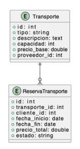
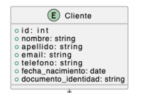
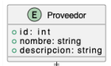
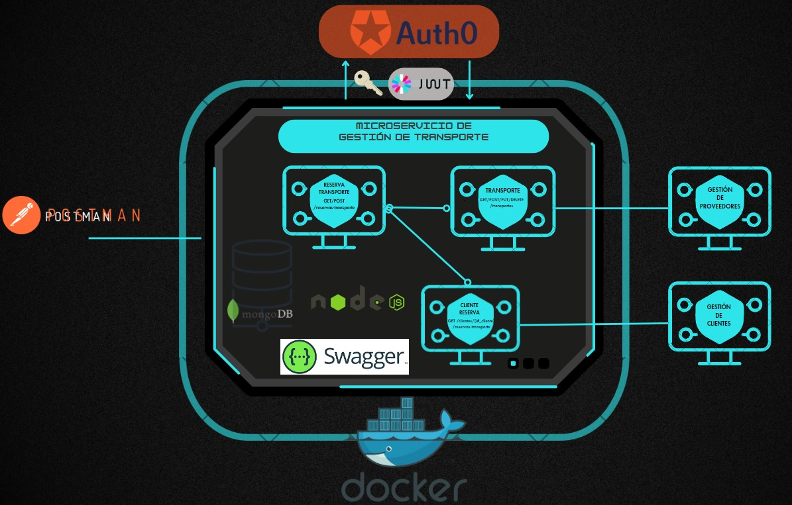
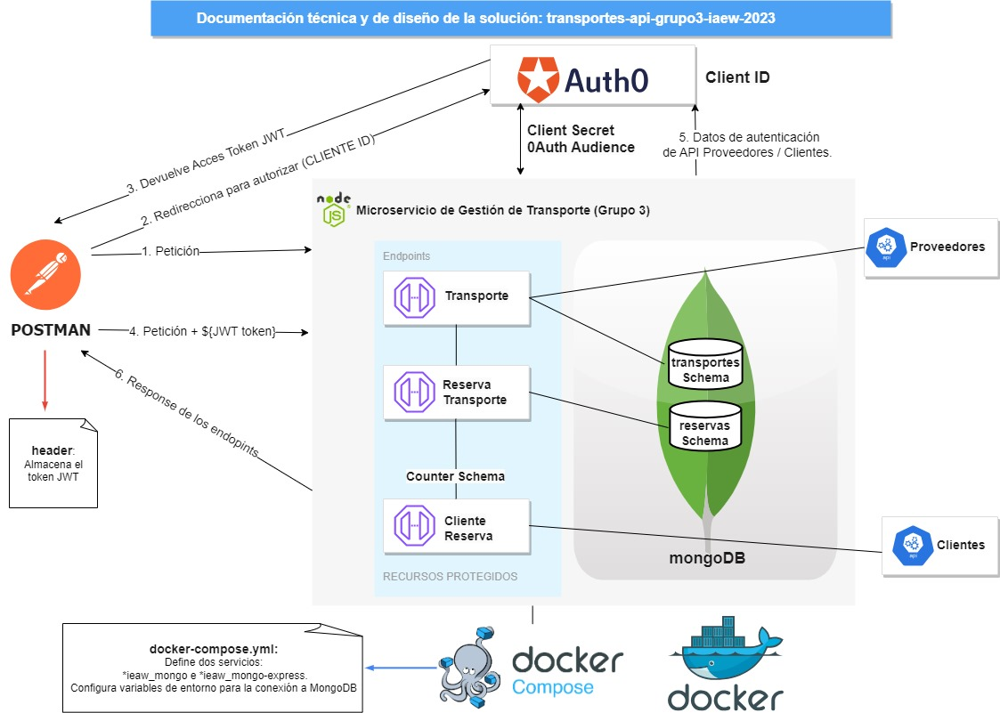

# IEAW-2023-5K4 - Sistema Integral de Gestión Turística  
## Microservicio de Gestión de Transporte (Grupo 3):
## Consignas
- Responsabilidades: Administrar información sobre servicios de transporte, como alquiler de coches, traslados, y reservas de transporte.
- Endpoints:
    - GET/POST/PUT/DELETE /transportes
    - GET/POST /reservas-transporte
    - GET /clientes/{id_cliente}/reservas-transporte
- Swagger:
    - /docs/
    - /docs/swagger.json
- Modelo:   

-  Relación con otro microservicio:
    - Integración de Aplicaciones en Entorno Web
    - Se relaciona con la Gestión de Clientes al recibir y gestionar las reservas realizadas por los clientes
        - *Se verifica la existencia del cliente al crear una reserva*
        - *Al listar las reservas de un cliente se muestran tambien los datos del cliente*
        - Modelo de cliente:  
            
    - Se relaciona con la Gestión de Proveedores al recibir y gestionar las reservas realizadas por los clientes
        - *Se verifica la existencia del proveedor al crear o actualizar un transporte*
        - *Al listar 1 o todos los transportes, se muestran tambien los datos del proveedor*
        - Modelo de Proveedor:  
            


### Datos Autenticación API Key:
- Access Token URL:   
```https://dev-iurrkasm0vjwzlgg.us.auth0.com/oauth/token```   
- OAuth Audience:    
```transportes-api-grupo3-iaew-2023```
- ClienteId:  
```ZscjjfQ1n7HuVzgBvy5Je9oKNIJHAAgo```
- Cliente Secret:  
```Te lo contamos en privado```  
 ### Documentación técnica y de diseño de la solución:
 ## Arquitectura:

## Mensajeria:
            